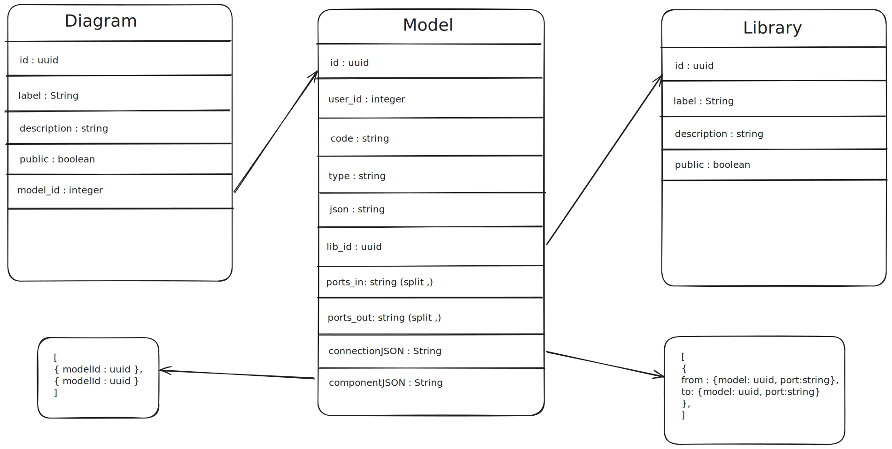
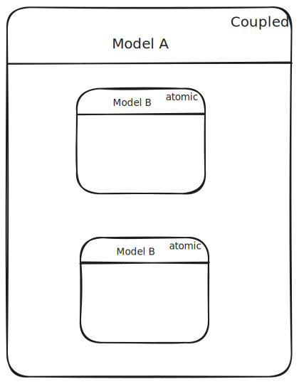
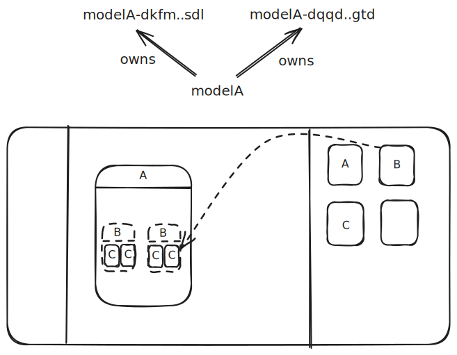
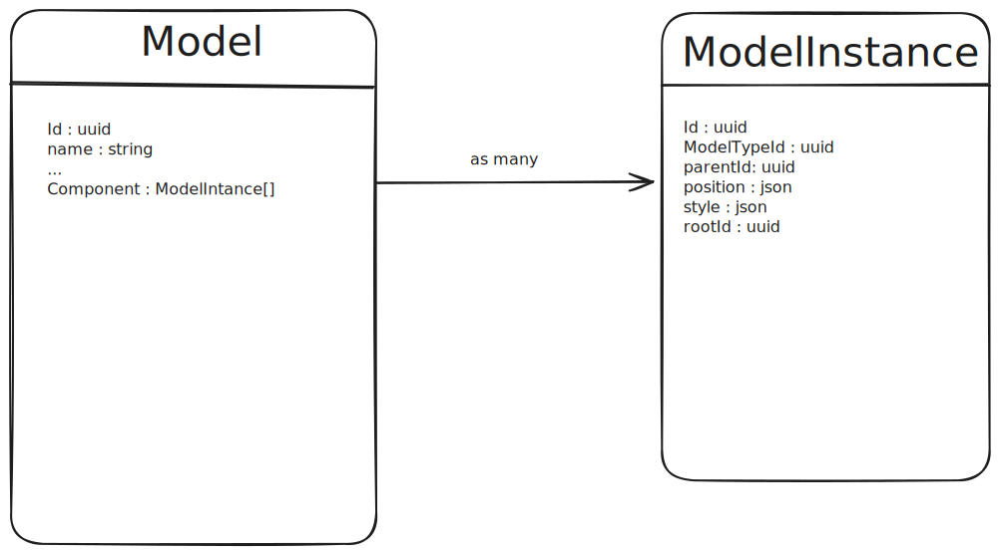
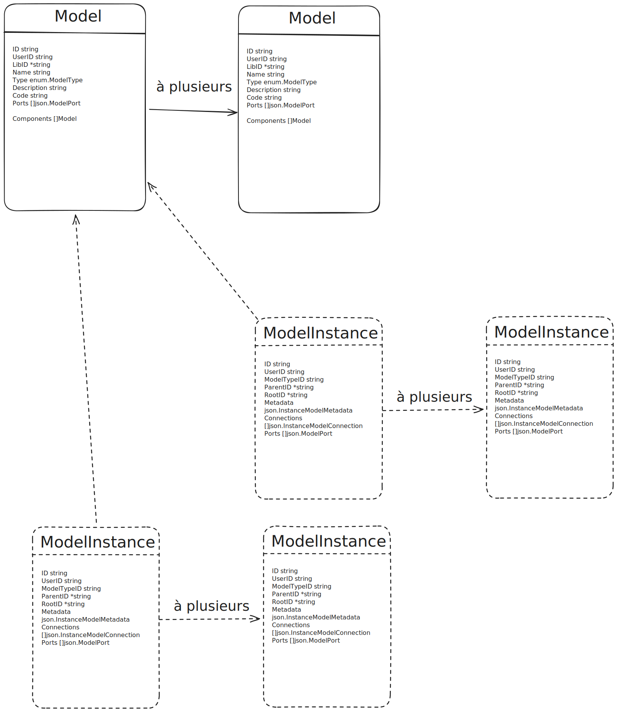
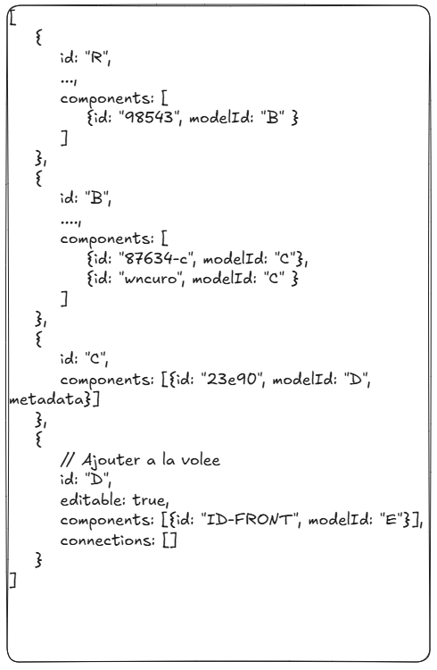
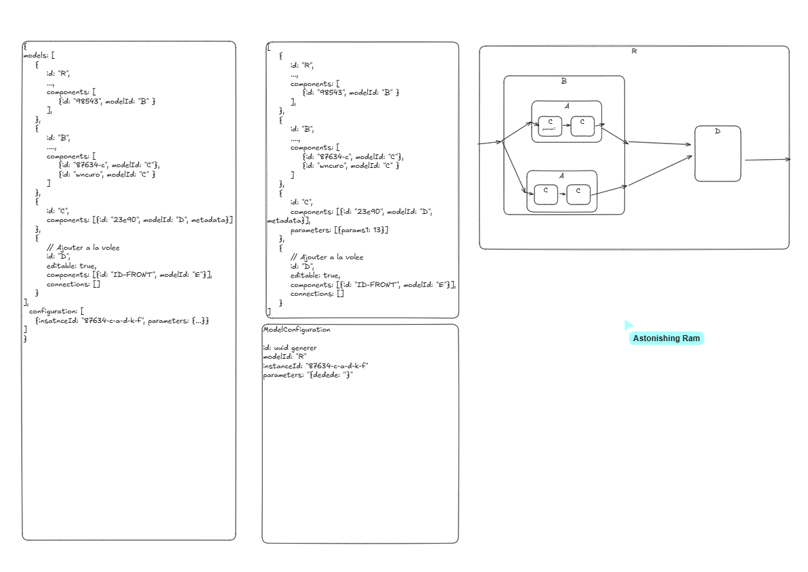

# Issue with DB model Structure 

## Issue incountered

### Explanation of the system in place when encoutering the issue

This is the structure of the Database, when we got the issue :



With that configuration, a coupled model ( Executable or not ) can possess multiple other model inside his componentJson attribute.
It will have also an array of connections from the 1st degree of hierarchy.

### Explanation of models renderer in front 

We are currently using React Flow to display our Models in the front. We used that library cause it is Open source and well followed, but also cause the library it self is rellay well made and allow a full customisation of the nodes, the edges and all the other aspects.

React Flow need to work his data type :

```json

[
  {
    id: '1',
    type: 'default',
    data: { label: 'Hello React Flow' },
    position: { x: 250, y: 100 },
  },
]

```

This folowing data type is fully customisable but ask for an unique id wich will lead to our issue.

### Issue with unique ID in the front

Both the model it self and the connection ask to have an unique id to be properly display.

In our case, a duplicate ID can be seen in different case like this one.



In this case we want to be able to add two time the same atomic model in another coupled model but we don't have anything to identify wich one is connected to another one. Creating a duplicate of model B with different ID will not a viable Solution.

This issue can be found at many layer in the hierachy cause of the recursirty implied in our model sructures.

## Solutions

Here many solution were thought, and we are gonna show the most viable of these one.

### ID made with path

The idea here is to change the format of the component JSON to add another ID to identify same model type models in another model.

```json 
[{
modelTypeID : uuid,
InstanceId : string
}]
```

The solution will be presented like this : 



This system will generate uuid in the front for any component of A model to ensure a unique id at every hierarchy level in the models structure.

The issue with that system is that it will be heavily depent on the front and the other theorical structure is not as good as we would have expected.

### Instance Model Structure

The solution implies on changing the data structure as follow : 



The structure here is changed to say that a model has many ModelInstance wich is another table. With a foreign Id, echa model isntance can be linked to specify model. 

Like we did in the past solution, the front will responsible of creating model instance every time that we will drag and drop a mdodel into a coupled model.

The id of the ModelInstance will be also generated in the front using UUID to avoid and minimize the probabilty of collision.

Howether, the solution here doesn't really make any sense. Why would we create an instance inside a model wich represent a structure.

## Final Solution 

The final solution relies on both solutions explain in the past. But we are gonna explain the structure of the given solution. We named the solution Template factory, wich is a system close to Factory Pattern but apply on hierarchical elements and in a database.
This the structure :



The model here will be the theorical source, and the instance will be the real used model in the diagrams. The model will have a normal structure, but it will reuse the system seen in the solution 1 for identifying model duplicate, we will use the name path of each one.

Now for the ModelInstance, every time that a user will drag and drop a model, it will call a route who will duplicate the model into a instance model to ensure unique ID in a ll the système.

### Resume

We are here gonna explain every data format :

### `Model` Table

| Field         | Type               | Description |
|---------------|--------------------|-------------|
| `ID`          | `string`           | Unique identifier of the model |
| `UserID`      | `string`           | ID of the user who owns this model |
| `LibID`       | `*string`          | Optional – ID of the library containing this model |
| `Name`        | `string`           | Model name |
| `Type`        | `enum.ModelType`   | Model type: `"atomic"`, `"coupled"`, or `"diagram"` |
| `Description` | `string`           | Text description of the model |
| `Code`        | `string`           | Source code (only for atomic models) |
| `Ports`       | `[]json.ModelPort` | List of input/output ports of the model |
| `Components`  | `[]Model`          | List of sub-models (used for coupled or diagram models) |

### Update 04/06/2025

After further reflection we are chosing to remove the Instance model idea from the final solution. Note : That could be use in hierarchy abstraction where you can define différent lelve of abstraction depending on the necessity.

The solution is simple : 
The root model ( the model at the base ) will contain all the information on the structure with his hierarchy.
It will possess all his 1st degree component and connection. His sub component will have the same until the end of the strucutre.



### Update 05/06/2025

An issue occured with the paramaters that need to be able to be change on the go. With the precedent solution, this fucntionnality will not work. To compensate that issue we decided to add on the model root layer, a configuration model wich allow to define all the configuration in the current coupled model.

One model will be reusable everywhere, with own configuriation defined by default or be extended by the root model ( First Coupled layer model ).


